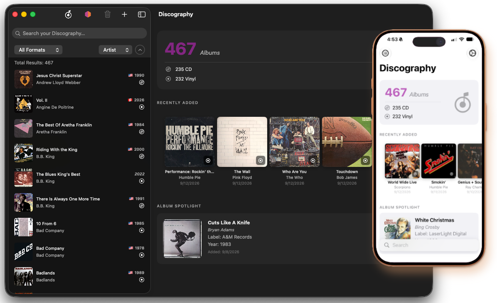
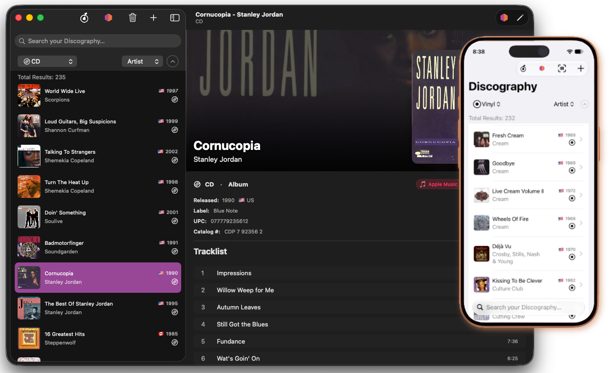
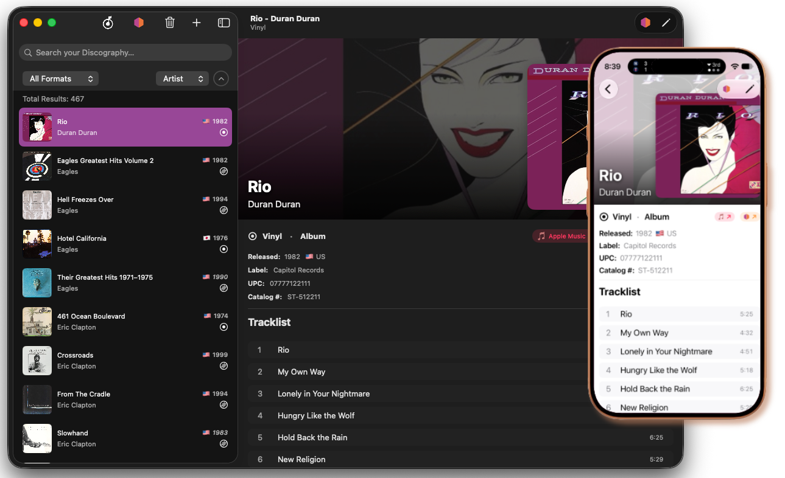
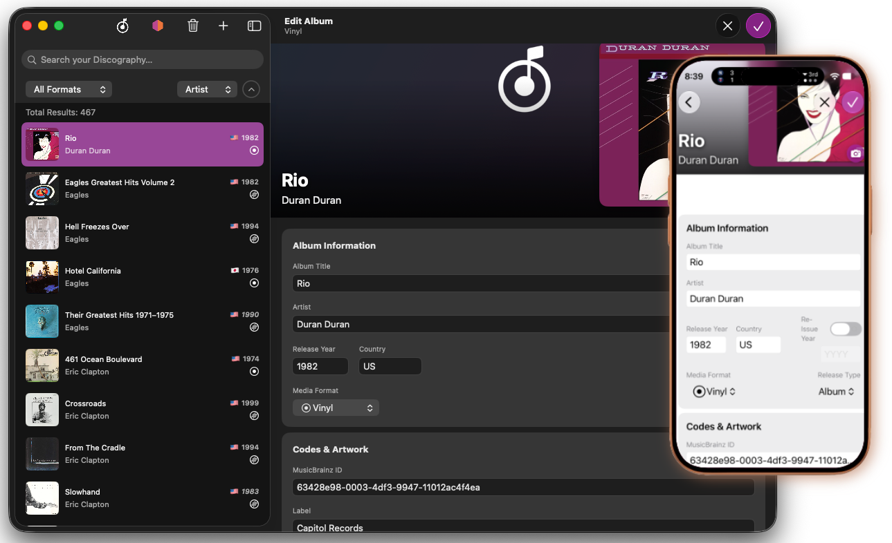

# User Interface

This page covers the main screens and layout of Discography: the **Home Screen**, the **Collection List**, and the **Album Detail View**.

---

## Getting Around

Discography uses a two-panel split layout. On Mac and iPad the sidebar shows your collection list on the left and the detail panel on the right. On iPhone the app starts on the detail panel (the Home screen); swipe or tap the list icon to get to the sidebar.

| Control | What it does |
| --- | --- |
| Discography logo (toolbar) | Returns to the Home screen |
| MusicBrainz icon (toolbar) | Toggles MusicBrainz search mode on/off |
| + button (toolbar) | Creates a new blank album entry |
| Barcode icon (toolbar, iOS) | Opens the barcode scanner |

---

## Home Screen

The Home screen is the default detail view when nothing is selected in the list.

**Statistics card** — shows your total album count and a breakdown by the two most common formats in your collection, with any remaining formats grouped under "All Other Formats."

**Recently Added** — a horizontal coverflow scroll of the albums you added most recently. Tap any card to open that album's detail view. The number of albums shown is configurable in Settings.

**Album Spotlight** — one album picked daily from your collection. The pick rotates each calendar day.

**Quick Actions (iOS only)** — shortcut buttons for `Add New Album` and `Scan Barcode`.

**Search bar (iPhone only)** — a floating search bar at the bottom of the Home screen lets you type a search and jump directly to the filtered collection list.

---

## Collection List

The sidebar lists all albums in your collection with cover art thumbnail, title, artist, year, country flag, and format icon.

> Note: If the album is marked as a re-issue, the Re-Issue Year will display in the collection list, not the original release year.

### Filtering and Sorting

A compact control strip sits above the list:

- **Format picker** — filter to a single media format (Vinyl, CD, Cassette, DVD, Blu-Ray, 8-Track, Other) or show all.
- **Sort picker** — sort by Artist, Album title, or Year.
- **Sort direction button** — toggles ascending/descending order.

A results count banner below the strip shows how many albums match the current filter and search. When an advanced search is active, a blue "Advanced" badge appears next to the count.

### List Actions

- **Tap / click** an album to open its detail view.
- **Swipe left (iOS)** on a row to reveal a Delete button.
- **Right-click / long-press** a row for a context menu with: Search MusicBrainz for this artist, Duplicate Album, and Delete Album.
- **Select multiple (macOS)** by clicking rows while holding Command or Shift, then use the Delete toolbar button to remove them all at once.
- **Pull to refresh (iOS MusicBrainz mode)** — reruns the current MusicBrainz search.

For details on deleting and duplicating albums, see [Managing Your Collection](collection.md).

---

## Album Detail

Tapping an album opens its detail view. The layout has two modes: **read-only** and **edit**.

### Read-Only View

- A hero banner at the top displays blurred cover art behind a gradient, with a full-resolution thumbnail on the right side.
- Title and artist are overlaid on the banner in large text.
- **Format / Release Type** displayed below the banner.
- **Rating** shown as filled record icons (1–5 scale) if set.
- Release metadata: year, country, reissue year, label, UPC, catalog number, media condition, sleeve condition, matrix/runout notes, and free-text notes.
- **Apple Music** pill — taps through to an Apple Music search for the album (requires internet).
- **MusicBrainz** pill — opens the release page on musicbrainz.org in your browser (shown only when a MusicBrainz ID has been linked).
- **Tracklist** — all tracks grouped by disc number, with position, title, and duration.
- **Credits** — sorted by role then name.
- **Tags** — displayed as colored pills.

On macOS you can drag the cover art thumbnail out of the window to share it with other apps.
On iOS, long-press the cover art thumbnail to Save to Photos or share it.

### Toolbar Buttons (read-only mode)

| Button | Action |
|---|---|
| MusicBrainz icon | Fetches missing metadata (tracks, credits, cover art) from MusicBrainz for albums that already have a MusicBrainz ID |
| Pencil / Edit | Switches to edit mode |

### Edit Mode

Tap **Edit** (pencil icon) to enter edit mode. All fields become editable. Tap **Save** (checkmark) to commit, or **Cancel** (×) to discard.

**Title** and **Artist** are required — Save is disabled until both are filled.

As you type in the Title, Artist, and Label fields, autocomplete suggestions drawn from your existing collection appear in a dropdown. Navigate with the arrow keys and press Return to accept a suggestion, or Escape to dismiss it.

---

#### Fields available in edit mode

| Field | Notes |
| --- | --- |
| **Album Title** | *Required* |
| **Artist** | *Required* |
| Year | Original release year |
| Country | Two-letter country code or full name |
| Format | Vinyl, CD, Cassette, DVD, Blu-Ray, 8-Track, Other |
| Release Type | Album, EP, Single, Compilation |
| Re-Issue Year | Year of the specific pressing you own |
| Label | Record label *(with autocomplete)* |
| UPC / Barcode | Numeric barcode |
| Catalog Number | Label catalog number |
| MusicBrainz ID | UUID for the release on musicbrainz.org |
| Rating | 1–5 record icons |
| Media Condition | M, NM, VG+, VG, G+, G, F, P |
| Sleeve Condition | Same scale as Media Condition |
| Matrix / Runout | Pressed-in matrix text (vinyl) |
| Notes | Free-text personal notes |
| Cover Art URL | Direct URL to cover art image |

---

#### Media Conditions

| Key | Value     |
| --- | ----------|
| M   | Mint      |
| NM  | Near Mint |
| VG+ | Very Good+|
| VG  | Very Good |
| G+  | Good+     |
| G   | Good      |
| F   | Fair      |
| P   | Poor      |

---

**Cover art** can also be set by:

- Clicking the camera button on the artwork thumbnail to pick an image from your Photos library (iOS) or file system (macOS).
- Dragging an image file onto the artwork thumbnail (macOS).
- Right-clicking / long-pressing the thumbnail and choosing Remove Artwork to clear it.

**Tracks** — tap **Add Track** to create a new track row. Each track has a position, disc number, title, and duration (in `m:ss` format). Tap the × on a row to remove it.

**Credits** — tap **Add Credit** to add a role/name pair (e.g., "Producer — Quincy Jones"). Tap × to remove.

**Tags** — type a tag name and press Return to add it, or tap the × on a pill to remove it. See [Managing Tags](advanced.md#managing-tags) for renaming and deleting tags across your whole collection.
